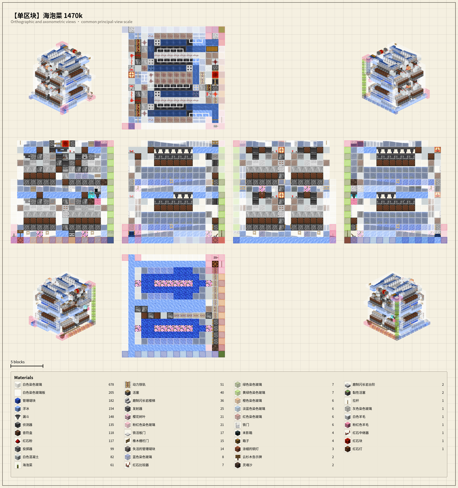

# Litematic Render / Minecraft Schematic 6 视图投影渲染器

> Render any Minecraft schematic (`.litematic`) into a 6-axis axonometric
> projection plus a complete materials workbook — directly from a real
> vanilla Minecraft client, with pixel-level blockstate fidelity.
>
> 用真实的原版 Minecraft 客户端渲染 `.litematic` 投影文件,生成 6 轴轴测投影
> 图 + 完整材料清单工作簿。逐像素 blockstate 保真,不近似、不偷工。



*Composite render of `【单区块】海泡菜 1470k` — a sea-pickle farm schematic,
rendered through the V153 6-view pipeline.*

*海泡菜 1470k 单区块投影的 V153 6 视图合成图样张。*

---

## ⚠️ 本地化提示 / Localization Notice

> **历史背景.** Buckets A 和 B (LOCALIZE.md) 已经过了。Java 包名迁到
> `io.github.rsegordon.litematic_render`、app.py 的硬编码绝对路径改读
> env-var + `~/litematic_render_tasks/` fallback、JDK 默认路径改成强制
> env-var、`gradle.properties` group 重命名、JUnit 测试 fixture 移到
> classpath resource、Fabric Loader / mixins 配置改成新包名、UI 标签
> 译成英文。
>
> ⚠️ **仍残留.** Bucket C (`V53_POC_plan.md` / `V54_POC_RESURRECT_REPORT.md` /
> `V55_Z_FLIP_FIX.md` / `V62_DYNAMIC_CAMERA.md` / `CODEX_TASK*.md`) 是
> 历史调研快照,仓库根目录可看到作者 home 路径 (反编译 MC 源、`hermes`
> 缓存布局)。这是 git 历史的一部分;切公开后别人能看到。如要清除需要
> `git-filter-repo` 重写历史。
>
> **Historical context.** Java package moved to `io.github.rsegordon
> .litematic_render`; hardcoded absolute paths in `app.py` are now
> env-var-driven with a `~/litematic_render_tasks/` fallback;
> `LITEMATIC_RENDER_JAVA_HOME` is required (no embedded default);
> `gradle.properties` group matches the new package; test fixture
> XLSX is on the classpath; UI labels translated to English.
>
> **Caveat:** historical V-plan and CODEX_TASK markdown files at repo
> root still contain author-absolute paths (Bucket C, see LOCALIZE.md).
> Git history preserves them. Scrubbing requires `git-filter-repo` and
> a force-push.

---

## 📚 目录 / Contents

1. [What it does / 工具产出](#-what-it-does--工具产出)
2. [Why this exists / 为什么做](#-why-this-exists--为什么做)
3. [Quick start / 快速上手](#-quick-start--快速上手)
4. [Requirements / 运行环境](#-requirements--运行环境)
5. [Architecture / 架构](#-architecture--架构)
6. [Render pipeline / 渲染流程](#-render-pipeline--渲染流程)
7. [Configuration / 配置](#-configuration--配置)
8. [Tests / 测试](#-tests--测试)
9. [History / 版本历史](#-history--版本历史)
10. [Repo layout / 仓库结构](#-repo-layout--仓库结构)
11. [License / 许可证](#-license--许可证)
12. [Localization / 本地化](#-localization--本地化)

---

## 📦 What it does / 工具产出

Given a `.litematic` file, the tool produces four artifacts per task:

| Artifact | Description |
|---|---|
| **Composite PNG** | Top + 5 side views of the bounding box, anchored on the principal corners. 6-view layout in a single image. |
| **Materials-only PNG** | Standalone `materials_only.png` — a justified two-column layout listing every block type, count, and percentage. Doubled font + resolution since V153. |
| **Materials XLSX** | Same data in workbook form, suitable for take-off / BOQ. Owner (the litematic's original author) gets a separate sheet. |
| **Render log** | Per-task stdout/stderr from the rendering Minecraft client — useful for debugging parity or capture stalls. |

每个 `.litematic` 任务产出以下四件:

| 产物 | 说明 |
|---|---|
| **合成 PNG** | 主视图 + 5 个侧视图,以 bbox 的主角点为锚。6 视图排版成一张图。 |
| **材料独立 PNG** | `materials_only.png` 独立文件。两列两端对齐排版,列出每种方块、数量、占比。V153 起字号 + 分辨率双倍。 |
| **材料 XLSX** | 同数据的工作簿格式,可直接做 BOQ。原作者(owner)另起独立 sheet。 |
| **渲染日志** | 每个任务对应的 Minecraft 客户端 stdout/stderr。便于排查 parity / 捕获 stall。 |

---

## 🎯 Why this exists / 为什么做

**EN.** Existing tools (Litematica, 3dLitematica) render in-editor; they
require a human at the keyboard and produce screenshots, not images you can
drop into a build sheet. This project runs Minecraft headlessly through
Fabric Loom, loads the schematic into an isolated `Superflat the_void`
world, captures six orthographic-style frames, and composites them —
without ever opening the UI.

The fidelity matters: blockstates are rendered by the same code path that
ships in vanilla, so fence rotations, redstone cross shapes, and trapdoor
orientations look exactly as they would in-game. No re-implementation,
no text approximations.

**中文.** 现有工具 (Litematica / 3dLitematica) 必须在编辑器内、手动操作、截屏。
本项目通过 Fabric Loom 引导 Minecraft 无头模式,把投影加载到独立
`Superflat the_void` 世界,捕获六个正交视图,合成到一起 —— 全程不开 UI。

保真度是核心。方块状态由原版 MC 同款渲染管线输出,栅栏朝向、红石十字、
活板门方向全部与游戏内一致。不重写、不近似。

---

## 🚀 Quick start / 快速上手

**EN.**

```bash
# 1. Compile the rendering client (needs JDK 25, 6 GB heap)
cd poc
./gradlew :runClient -Pargs="--render FILE.litematic --out OUT_DIR"

# 2. (optional) Spin up the Flask UI
cd poc/tools/litematic_render_ui
python3 app.py            # listens on :19995
```

Upload a `.litematic` through the web UI (or call the renderer CLI
directly). The tool records a task, dispatches it to the renderer, and
writes the four artifacts into the task directory.

**中文.**

```bash
# 1. 编译渲染客户端 (需 JDK 25, 6 GB 堆)
cd poc
./gradlew :runClient -Pargs="--render FILE.litematic --out OUT_DIR"

# 2. (可选) 启动 Flask UI
cd poc/tools/litematic_render_ui
python3 app.py            # 监听 :19995
```

通过网页 UI 上传 `.litematic` (或直接调渲染命令行)。工具记录任务、派发
渲染、把四件产物写到任务目录。

---

## 🛠 Requirements / 运行环境

**EN.**

- **JDK 25** — `org.gradle.jvmargs=-Xmx6g` requires 6 GB heap for the
  rendering client.
- **Minecraft 26.2** (snapshot) — `minecraft_version=26.2` in
  `gradle.properties`.
- **Fabric Loader 0.19.3** + **Fabric API 0.158.0+26.2**.
- **Python 3.10+** with `flask`, `nbtlib` (UI side).
- **Linux + Xvfb** OR a **headless GPU** — the renderer spins up an
  offscreen Minecraft client per task, killed on completion.

Set `LITEMATIC_RENDER_JAVA_HOME` if your JDK is not on `PATH`.
On production hosts the renderer is killed and restarted per task to
avoid state leakage between litematics.

**中文.**

- **JDK 25** —— `org.gradle.jvmargs=-Xmx6g`,渲染客户端需 6 GB 堆。
- **Minecraft 26.2** (snapshot) —— 见 `gradle.properties`。
- **Fabric Loader 0.19.3** + **Fabric API 0.158.0+26.2**。
- **Python 3.10+** —— UI 端依赖 `flask`、`nbtlib`。
- **Linux + Xvfb** 或 **无头 GPU** —— 每个任务启一个离屏 MC,完成后退出。

JDK 不在 `PATH` 上时,设置 `LITEMATIC_RENDER_JAVA_HOME`。
生产环境渲染器每次任务后强杀重启,避免状态泄漏。

---

## 🏛 Architecture / 架构

**EN.**

```
poc/
├── src/main/java/io/github/rsegordon/litematic_render/
│   ├── LitematicRenderCommand.java    # /gradlew runClient entry point
│   ├── LitematicRenderMod.java        # mod entry; wires the renderer
│   ├── OffscreenRenderer.java         # capture + composite + materials walk
│   ├── MaterialWorkbookWriter.java    # XLSX output
│   ├── OutputArchiveWriter.java       # tar.gz bundle of all artifacts
│   ├── BackgroundPass.java            # paper background fill pass
│   └── mixin/                         # fabric mixins for off-screen capture
├── src/test/java/io/github/rsegordon/litematic_render/
│   ├── OffscreenRendererEngineeringSheetLayoutTest.java
│   ├── OffscreenRendererMaterialsLayoutTest.java
│   ├── OffscreenRendererChunkCoverageTest.java
│   ├── OffscreenRendererPrincipalProjectionTest.java
│   ├── OffscreenRendererWorldCreationTest.java
│   ├── OffscreenRendererVoidTerrainTest.java
│   ├── OffscreenRendererPlatformClearTest.java
│   ├── OffscreenRendererProgressTest.java
│   ├── OffscreenRendererRenderReadyTest.java
│   ├── MaterialWorkbookWriterTest.java
│   ├── OutputArchiveWriterTest.java
│   └── SingleViewTransparencyTest.java
└── tools/litematic_render_ui/
    ├── app.py                          # Flask blueprint (env-var-driven paths)
    └── templates/                      # 4 Jinja2 templates
```

**中文.**

```
poc/
├── src/main/java/io/github/rsegordon/litematic_render/
│   ├── LitematicRenderCommand.java    # /gradlew runClient 入口
│   ├── LitematicRenderMod.java        # mod 入口,装配渲染器
│   ├── OffscreenRenderer.java         # 捕获 + 合成 + 材料遍历
│   ├── MaterialWorkbookWriter.java    # XLSX 输出
│   ├── OutputArchiveWriter.java       # tar.gz 打包所有产物
│   ├── BackgroundPass.java            # paper 底色填充 pass
│   └── mixin/                         # Fabric mixins,离屏捕获
├── src/test/java/io/github/rsegordon/litematic_render/
│   ├── ...11 个 JUnit 5 测试...
└── tools/litematic_render_ui/
    ├── app.py                          # Flask 蓝图 (env-var-driven)
    └── templates/                      # 4 个 Jinja2 模板 (英文 UI 标签)
```

---

## ⚙️ Render pipeline / 渲染流程

**EN.** Each task follows eight steps:

1. **Bootstrap** — Flask UI writes the `.litematic` into
   `LITEMATIC_DIR/<task-id>/raw/` and records the task in
   `LITEMATIC_DIR/tasks.json`.
2. **Spawn renderer** — `LITEMATIC_RENDER_DISTANCE_CHUNKS` (default 32)
   controls chunk coverage; `LITEMATIC_RENDER_DISTANCE_SAFETY_CHUNKS`
   (default 2) extends the area slightly to clip edges cleanly.
3. **Isolated world** — the renderer creates a brand-new
   `Superflat the_void` world per task (`RENDER_WORLD_PREFIX =
   "LitematicRender_"`), preventing spawn-platform leakage from a previous
   task.
4. **Load schematic** — the litematic is pasted at world spawn, then the
   renderer walks the bounding box.
5. **Six-view capture** — for each principal corner, the renderer drives
   an orthographic frame, captures the framebuffer, and composites.
6. **Materials walk** — single pass over the loaded region; aggregates
   counts, joins back to blockstate IDs through the `client_assets/` JSON
   map.
7. **Write artifacts** — composite PNG, materials-only PNG, XLSX workbook,
   and a tar.gz archive; written through `OutputArchiveWriter`.
8. **Cleanup** — the temp world is deleted; the JLS reports
   `cleaned temporary render world /.../LitematicRender_<uuid>`.

**中文.** 每个任务分八步:

1. **引导** —— Flask UI 把 `.litematic` 写到 `LITEMATIC_DIR/<task-id>/raw/`,
   并在 `LITEMATIC_DIR/tasks.json` 记录任务。
2. **启动渲染器** —— `LITEMATIC_RENDER_DISTANCE_CHUNKS` (默认 32) 控制区块
   覆盖范围;`LITEMATIC_RENDER_DISTANCE_SAFETY_CHUNKS` (默认 2) 多渲一圈保证
   边缘裁切干净。
3. **隔离世界** —— 每个任务创建一个全新 `Superflat the_void` 世界
   (`RENDER_WORLD_PREFIX = "LitematicRender_"`),避免上次任务 spawn 平台泄漏。
4. **加载投影** —— 投影 paste 到世界出生点,渲染器走遍 bbox。
5. **6 视图捕获** —— 每个主角点驱动一个正交帧、捕获 framebuffer、合成。
6. **材料遍历** —— 单次遍历加载区域,统计数量,通过 `client_assets/` JSON
   map 关联回 blockstate ID。
7. **写产物** —— 合成 PNG、独立材料 PNG、XLSX 工作簿、tar.gz 归档,由
   `OutputArchiveWriter` 输出。
8. **清理** —— 临时世界被删除,日志显示 `cleaned temporary render world
   /.../LitematicRender_<uuid>`。

---

## 🔧 Configuration / 配置

### Environment variables

| Variable | Default | Meaning |
|---|---|---|
| `LITEMATIC_RENDER_DIR` | `~/litematic_render_tasks/` | Storage root for uploaded litematics and per-task artifacts. |
| `LITEMATIC_RENDER_JAVA_HOME` | (required, no default) | JDK location for the renderer. Set on the deploy host. |
| `LITEMATIC_RENDER_DISTANCE_CHUNKS` | `32` | chunk radius covered per task. |
| `LITEMATIC_RENDER_DISTANCE_SAFETY_CHUNKS` | `2` | extra chunks for safe edge clipping. |

### `poc/gradle.properties`

| Key | Value | Note |
|---|---|---|
| `minecraft_version` | `26.2` | vanilla MC snapshot. |
| `loader_version` | `0.19.3` | Fabric Loader. |
| `fabric_version` | `0.158.0+26.2` | Fabric API. |
| `org.gradle.jvmargs` | `-Xmx6g` | gradle daemon needs 6 GB. |

---

## 🧪 Tests / 测试

**EN.**

```bash
cd poc
./gradlew test
```

Eleven JUnit 5 suites cover layout parity, principal projection
alignment, the isolated-the-void world creation, the spawn-platform-clear
behavior, chunk coverage, progress reporting, and the XLSX / archive
writers. They run headlessly — no Minecraft client is booted during
tests.

**中文.**

```bash
cd poc
./gradlew test
```

11 个 JUnit 5 测试套件,覆盖:布局 parity、主角投影对齐、独立 the_void
世界创建、spawn 平台清除、区块覆盖、进度上报、XLSX / 归档写入器。无头
执行,测试时不启动 MC 客户端。

> 注:owner workbook 测试 fixture (`owner_workbook_template.xlsx`) 现在
> 走 classpath,见 LOCALIZE B-2。

---

## 🕓 History / 版本历史

**EN.** The renderer is the result of ~150 incremental versions across
three months (V30 → V153). Major milestones:

- **V132** — replaced the size cap with a camera-distance render limit.
- **V133** — materials workbook accepts any number of rows.
- **V134** — forced the render world to a vanilla `the_void` superflat.
- **V135** — cleared the spawn-protection platform after the void-world creation.
- **V136** — isolated temp render worlds and validated real chunk coverage.
- **V138** — derived principal frames from the camera basis.
- **V139** — unified the engineering layout and stabilized parity.
- **V140** — stabilized capture, axon layout, and progress UI.
- **V141** — constrained axon views to principal corner slots.
- **V142** — anchored axons + scaled sheet UI.
- **V150** — 6-view composite + orphan sweep + PAPER_COLOR fullbright toggle.
- **V151** — standalone `materials_only.png` (justified columns).
- **V152** — dual download buttons on the materials card (XLSX + PNG).
- **V153** — 2x font + 2x resolution via `Graphics2D.scale(2,2)`.

The full iterative log lives in the commit history; early `V30`-`V90`
versions are simpler render prototypes kept on the `master` branch for
traceability.

**中文.** 渲染器从 V30 一路演化到 V153,约 150 个迭代版本。主要里程碑:

- **V132** —— 用相机距离限制代替尺寸硬性上限。
- **V133** —— 材料工作簿支持任意行数。
- **V134** —— 强制渲染世界为原版 `the_void` 超平坦。
- **V135** —— the_void 世界创建后清除 spawn 保护平台。
- **V136** —— 隔离临时渲染世界,验证区块真覆盖。
- **V138** —— 从相机基推导主角帧。
- **V139** —— 统一工程图布局 + parity 稳定化。
- **V140** —— 捕获 / axon 布局 / 进度 UI 稳定。
- **V141** —— axon 视图约束到主角点槽位。
- **V142** —— axon 锚定 + 表格 UI 缩放。
- **V150** —— 6 视图合成 + orphan sweep + PAPER_COLOR fullbright 开关。
- **V151** —— 独立 `materials_only.png`(两端对齐列)。
- **V152** —— 材料卡片双下载按钮 (XLSX + PNG)。
- **V153** —— 通过 `Graphics2D.scale(2,2)` 字号 / 分辨率双倍。

完整迭代日志见 commit 历史;早期 V30-V90 是更简单的渲染原型,留在
`master` 分支便于追溯。

---

## 🗂 Repo layout / 仓库结构

```
.
├── a_render_texture.py             # V1 ASCII/texture renderer
├── a_render_v3.py / a_render_v4.py # V1 model + blockstate parser
├── f_render_ascii.py               # V1 ASCII renderer
├── render_3d.js                    # V1 Three.js prototype (initial commit)
├── convert_entity_models.py        # V1 entity-model debug helper
├── client_assets/                  # extracted vanilla MC 1.21.1 blockstates + models
├── poc/                            # the active renderer (see Architecture)
├── tests/                          # regression test litematics
├── docs/
│   └── preview-composite.png       # README 头图,海泡菜 1470k 渲染样张
├── LOCALIZE.md                     # 本地化清单 (切公开仓前必读)
└── README.md                       # This file
```

**EN.** The V1 ASCII/texture/Three.js prototypes are kept around for
traceability — they show how the project started and what we discarded.

**中文.** V1 的 ASCII / texture / Three.js 原型代码保留,便于追溯项目
起点和当时被淘汰的思路。

---

## 📝 License / 许可证

**EN.** Personal project. The render client (`poc/src/main/java/`)
is the author's own code. The materials workbook template XLSX bundled
in `src/test/resources/` is the author's own — third-party owners of
their own Minecraft schematics should provide their own template.

No explicit open-source license is granted. By default, "all rights
reserved" applies (since no LICENSE file is shipped). The author may
add a license in a future commit.

**中文.** 个人项目,保留所有权利。Matrials workbook 的 owner template 由
作者本人提供,如需重用于别的 Minecraft 投影,使用者应替换成自己的
template XLSX。当前未发布 LICENSE 文件,默认按"保留所有权利"处理。

---

## 🌐 Localization / 本地化

**EN.** See [`LOCALIZE.md`](./LOCALIZE.md). Items are split into three
buckets:

- **Block public-publish (Bucket A)** — Java group, package, app.py
  hardcoded paths, JDK location default, UI log translations.
- **Hardcoded test fixtures (Bucket B)** — `MaterialWorkbookWriter`
  sample file path, `OffscreenRendererWorldCreationTest` source-relative
  path.
- **Aesthetic / branding (Bucket C)** — repo URL on GitHub, Java
  package name as visible source-tree label.

Run `git grep -n "rsegordon\|/home/rsegordon"` to enumerate every
location.

**中文.** 见 [`LOCALIZE.md`](./LOCALIZE.md)。分三档:

- **A 档:切公开仓前必须改** —— Java group / 包名,`app.py` 硬编码路径,
  JDK 默认路径,UI 日志翻译。
- **B 档:本地化时再改** —— 测试 fixture 路径、`WorldCreationTest` 的
  src 相对路径。
- **C 档:审美** —— 仓库 URL、Java 包名作为源码树可见标签。

跑 `git grep -n "rsegordon\|/home/rsegordon"` 列出所有点。
